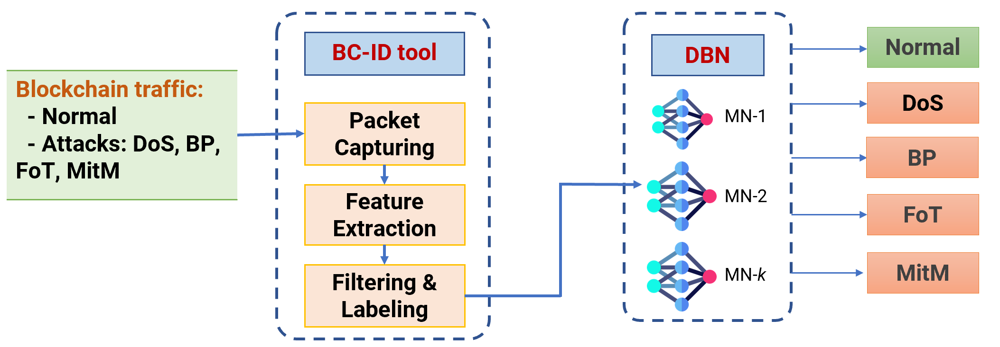

## BTAD: Blockchain Network Attack Traffic dataset

> #### Contact: Mr. Viet Khoa Tran, 
> #### - Cyber Security Engineer at the University of Canberra (UC). Email: [ khoa.tran@canberra.edu.au](mailto:khoa.tran@canberra.edu.au) 
> #### - Ph.D. Candidate at the University of Technology Sydney (UTS). Email: [ khoa.v.tran@student.uts.edu.au](mailto:khoa.v.tran@student.uts.edu.au)

## Dataset overview

#### Experiment setup

In our experiments, we set up an Ethereum blockchain network in our laboratory which includes three Ethereum fullnodes, an Ethereum bootnode, and a netstats server. All these nodes are connected to a Cisco Switch Catalyst 2950. The details of these nodes are as follows:
- Ethereum fullnodes are launched by *Geth v1.10.14* - open-source software for implementation of the Ethereum protocol. These nodes share the same initial configuration of genesis block, i.e., PoW consensus mechanism, 8,000,000 gas for block gas limit, initial difficulty 100,000. Each node is running on a personal computer with processor Intel® Core™ i7-4800MQ @2.7 GHz, RAM of 16 GB.
- Bootnode is also created by *Geth v1.10.14* and connected to the three Ethereum nodes.
- Ethereum netstats is launched by an open-source software named "eth-netstats" on Github.

#### Dataset collection and Feature extraction
We perform four typical types of network attacks that have been reported in blockchain networks, i.e., the BP for wallet theft; DoS and MitM for information loss; and FoT for consensus delay. These are the ubiquitous attacks in the network traffic layer that have caused a number of serious consequences for many years. More details are as follows:
1. Brute Password (**BP**) attack: is derived from traditional cyberattack when hackers perform such attacks to steal blockchain users' accounts. In this way, the hackers can access the users' wallets and steal their digital assets. 

2. Denial of Service (**DoS**) attack: is also another common type of attack in blockchain networks as it can be easily performed to attack blockchain nodes. 

3. Flooding of Transactions (**FoT**) attack: targets delay the PoW blockchain network by spamming the blockchain network with null or meaningless transactions. 

4. Man in the Middle (**MitM**) attack: is another typical attack where an attacker places himself between the legitimate communicating parties and secretly relays and possibly modifies the information exchanged between them. In this way, the attacker can intercept, read, and modify the blockchain messages. 

 
 

Figure 1: Flowchart of Collecting the BTAD dataset and Collaborative Learning for Cyberattack Detection in Blockchain Networks.

 
 

Table 1: Features of the BTAD dataset.

| \#                                                        | **Features name**                  | **T** | **Description**                                                                       |
| :-------------------------------------------------------- | :--------------------------------- | :---- | :------------------------------------------------------------------------------------ |
| **Basic features**                                        |                                    |       |                                                                                       |
| 1                                                         | *duration*                         | C     | length of the connection   (seconds)                                               |
| 2                                                         | *protocol\_type*                   | D     | type of the protocol   (i.e., tcp, udp, icmp)                                      |
| 3                                                         | *service*                          | D     | network service   (e.g., http, ssh, etc)                                           |
| 4                                                         | *src\_bytes*                       | C     | number of data bytes   from source to destination                                  |
| 5                                                         | *dst\_bytes*                       | C     | number of data bytes   from destination to source                                  |
| 6                                                         | *flag*                             | D     | normal or error status   of the connection                                         |
| **Statistical features **                                 |                                    |       |                                                                                       |
| *Features refer to source IP-based Statistical*           |                                    |       |                                                                                       |
| 7                                                         | *count*                            | C     | number of connections to   the same source IP   as the current connection       |
| 8                                                         | *srv\_count*                       | C     | number of connections to   the same service   as the current connection         |
| *Features refer to these same source IP connections*      |                                    |       |                                                                                       |
| 9                                                         | *serror\_rate*                     | C     | % of `SYN' errors connections                                                         |
| 10                                                        | *same\_srv\_rate*                  | C     | % of same service connections                                                         |
| 11                                                        | *diff\_srv\_rate*                  | C     | % of different services   connections                                              |
| *Features refer to these same service connections*        |                                    |       |                                                                                       |
| 12                                                        | *srv\_serror\_rate*                | C     | % of `SYN' errors connections                                                         |
| 13                                                        | *srv\_diff\_host\_rate*            | C     | % of different host connections                                                       |
| *Features refer to destination IP-based Statistical*      |                                    |       |                                                                                       |
| 14                                                        | *dst\_host\_count*                 | C     | number of connections to   the same destination IP    as the current connection |
| 15                                                        | *dst\_host\_srv\_count*            | C     | number of connections to   the same service as   the current connection         |
| *Features refer to these same destination IP connections* |                                    |       |                                                                                       |
| 16                                                        | *dst\_host\_same\_srv\_rate*       | C     | % of same service connections                                                         |
| 17                                                        | *dst\_host\_diff\_srv\_rate*       | C     | % of different services   connections                                              |
| 18                                                        | *dst\_host\_same\_src\_port\_rate* | C     | % of same both source port   and destination IP connections                        |
| 19                                                        | *dst\_host\_serror\_rate*          | C     | % of `SYN' errors connections                                                         |
| *Features refer to these same service connections*        |                                    |       |                                                                                       |
| 20                                                        | *dst\_host\_srv\_diff\_host\_rate* | C     | % of different host connections                                                       |
| 21                                                        | *dst\_host\_srv\_serror\_rate*     | C     | % of `SYN' errors connections                                                         |

## Data explorer

| duration | protocol_type | service | src_bytes | dst_bytes | flag | count | srv_count | serror_rate | same_srv_rate | diff_srv_rate | srv_serror_rate | srv_diff_host_rate | dst_host_count | dst_host_srv_count | dst_host_same_srv_rate | dst_host_diff_srv_rate | dst_host_same_src_port_rate | dst_host_serror_rate | dst_host_srv_diff_host_rate | dst_host_srv_serror_rate | label  |
| -------- | ------------- | ------- | --------- | --------- | ---- | ----- | --------- | ----------- | ------------- | ------------- | --------------- | ------------------ | -------------- | ------------------ | ---------------------- | ---------------------- | --------------------------- | -------------------- | --------------------------- | ------------------------ | ------ |
| 0        | tcp           | http    | 408       | 0         | OTH  | 14    | 13        | 0           | 0.64          | 0.36          | 0               | 0.31               | 14             | 13                 | 0.64                   | 0.36                   | 0.21                        | 0                    | 0.31                        | 0                        | MitM   |
| 0        | tcp           | other   | 66        | 0         | OTH  | 5     | 15        | 0           | 1             | 0             | 0               | 0.67               | 5              | 15                 | 1                      | 0                      | 0.31                        | 0                    | 0.67                        | 0                        | Normal |
| 0        | tcp           | other   | 66        | 0         | OTH  | 1045  | 2549      | 0           | 1             | 0             | 0               | 0.59               | 50             | 96                 | 1                      | 0                      | 0.52                        | 0                    | 0.48                        | 0                        | Normal |
| 0        | tcp           | http    | 232       | 0         | OTH  | 12    | 32        | 0           | 1             | 0             | 0               | 0.62               | 12             | 32                 | 1                      | 0                      | 0.36                        | 0                    | 0.62                        | 0                        | Normal |
| 0        | tcp           | other   | 66        | 0         | OTH  | 9     | 23        | 0           | 1             | 0             | 0               | 0.61               | 9              | 23                 | 1                      | 0                      | 0.38                        | 0                    | 0.61                        | 0                        | Normal |
| 0        | tcp           | http    | 294       | 0         | OTH  | 0     | 71        | 0           | 0             | 0             | 0               | 1                  | 0              | 71                 | 0                      | 0                      | 0.33                        | 0                    | 1                           | 0                        | BP     |
| 0        | tcp           | http    | 834       | 435       | S1   | 22    | 14        | 0.05        | 0.45          | 0.55          | 0.07            | 0.29               | 22             | 14                 | 0.45                   | 0.55                   | 0                           | 0.05                 | 0.29                        | 0.07                     | MitM   |
| 0        | tcp           | other   | 66        | 0         | OTH  | 563   | 54        | 0           | 0.05          | 0.95          | 0               | 0.52               | 58             | 6                  | 0.03                   | 0.97                   | 0.14                        | 0                    | 0.67                        | 0                        | Normal |
| 0        | tcp           | http    | 169       | 0         | OTH  | 9     | 23        | 0           | 1             | 0             | 0               | 0.61               | 9              | 23                 | 1                      | 0                      | 0.38                        | 0                    | 0.61                        | 0                        | Normal |
| 0        | tcp           | http    | 60        | 0         | S1   | 329   | 343       | 0.88        | 0.98          | 0.02          | 0.84            | 0.06               | 100            | 100                | 1                      | 0                      | 0                           | 1                    | 0                           | 1                        | DoS    |
| 0        | tcp           | other   | 258       | 0         | OTH  | 1     | 5         | 0           | 1             | 0             | 0               | 0.8                | 1              | 5                  | 1                      | 0                      | 0.5                         | 0                    | 0.8                         | 0                        | Normal |
| 0        | tcp           | other   | 66        | 0         | OTH  | 4     | 5         | 0           | 1             | 0             | 0               | 0.2                | 4              | 5                  | 1                      | 0                      | 0                           | 0                    | 0.2                         | 0                        | Normal |
| 0        | tcp           | http    | 599       | 526       | SF   | 1     | 1         | 0           | 1             | 0             | 0               | 0                  | 1              | 1                  | 1                      | 0                      | 0                           | 0                    | 0                           | 0                        | Normal |
| 0        | tcp           | other   | 66        | 0         | OTH  | 597   | 985       | 0           | 0.94          | 0.06          | 0               | 0.43               | 49             | 96                 | 0.96                   | 0.04                   | 0                           | 0                    | 0.51                        | 0                        | Normal |
| 0        | tcp           | http    | 295       | 0         | OTH  | 0     | 3         | 0           | 0             | 0             | 0               | 1                  | 0              | 3                  | 0                      | 0                      | 0                           | 0                    | 1                           | 0                        | BP     |
| 0        | tcp           | other   | 66        | 0         | OTH  | 51    | 68        | 0           | 0.92          | 0.08          | 0               | 0.31               | 51             | 68                 | 0.92                   | 0.08                   | 0                           | 0                    | 0.31                        | 0                        | Normal |
| 0        | tcp           | other   | 66        | 0         | OTH  | 47    | 70        | 0           | 0.91          | 0.09          | 0               | 0.39               | 47             | 70                 | 0.91                   | 0.09                   | 0                           | 0                    | 0.39                        | 0                        | Normal |
| 0        | tcp           | http    | 406       | 0         | OTH  | 17    | 13        | 0           | 0.59          | 0.41          | 0               | 0.23               | 17             | 13                 | 0.59                   | 0.41                   | 0.14                        | 0                    | 0.23                        | 0                        | MitM   |
| 0        | tcp           | http    | 409       | 0         | OTH  | 1729  | 3014      | 0           | 0.97          | 0.03          | 0               | 0.44               | 53             | 95                 | 0.94                   | 0.06                   | 0.09                        | 0                    | 0.47                        | 0                        | FoT    |
| 0        | tcp           | http    | 181       | 0         | OTH  | 2     | 8         | 0           | 1             | 0             | 0               | 0.75               | 2              | 8                  | 1                      | 0                      | 0.22                        | 0                    | 0.75                        | 0                        | Normal |
| 0        | tcp           | http    | 392       | 0         | OTH  | 7     | 3         | 0           | 0.43          | 0.57          | 0               | 0                  | 7              | 3                  | 0.43                   | 0.57                   | 0                           | 0                    | 0                           | 0                        | MitM   |
| 0        | tcp           | other   | 66        | 0         | OTH  | 36    | 49        | 0           | 0.83          | 0.17          | 0               | 0.39               | 36             | 49                 | 0.83                   | 0.17                   | 0                           | 0                    | 0.39                        | 0                        | Normal |

 
 

<b>This dataset is free for use for academic purposes such as study and research. However, using this dataset for commercial purposes requires approval from the authors. The details of the BTAD dataset were published in the following paper. For academic or public use of this dataset, the authors must cite the following paper:</b>

 Tran Viet Khoa, Do Hai Son, Dinh Thai Hoang, Nguyen Linh Trung, Tran Thi Thuy Quynh, Diep N. Nguyen, Nguyen Viet Ha, and Eryk Dutkiewicz, "Collaborative Learning for Cyberattack Detection in Blockchain Networks," <i>IEEE Transactions on Systems, Man, and Cybernetics: Systems</i>, Feb. 2024. (accepted) <a href="https://arxiv.org/abs/2203.11076" target="_blank">[pre-print]</a>

## Acknowledgements

This work was supported by the <b><i>ASEAN IVO (ICT Virtual Organization of ASEAN Institutes and NICT)</i></b> under Project: <b>Cyber-Attack Detection and Information Security for Industry 4.0</b>. More information at: <a href="https://www.nict.go.jp/en/asean_ivo/ASEAN_IVO_2018_Projects02.html" target="_blank">https://www.nict.go.jp/en/asean_ivo/ASEAN_IVO_2018_Projects02.html</a>. 

  

> Docs website is powered by [docsify](https://docsify.js.org/)
