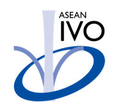

## BTAT: Blockchain Transaction-based Attacks dataset

> #### Contact: Dr. Viet Khoa Tran, 
> #### - Cyber Security Engineer at the University of Canberra (UC). Email: [ khoa.tran@canberra.edu.au](mailto:khoa.tran@canberra.edu.au) 

## Dataset overview

#### Experiment setup

In our experiments, we set up an Ethereum blockchain network in our laboratory which includes five Ethereum nodes and two Ethereum bootnode. All these nodes are connected to a Cisco Switch Catalyst 2950. The details of these nodes are as follows:
-  Ethereum nodes are launched by *Geth v1.10.22* - an official open-source implementation of Ethereum network and *Prysm v3.2.0* - an official implementation of the PoS consensus mechanism in Ethereum 2.0. They share the same genesis configurations, e.g., chainID, block gas limit at 30,000,000 gas, etc. The configurations of nodes 1, 2, and 3 are workstation computers with processor Intel Core i9-10900 @5.2 GHz, RAM of 64GB. The configurations of nodes 4 and 5 are personal computers with processor Intel Core i7-4810MQ @3.8 GHz, RAM of 16 GB.
- Geth bootnode and Prysm bootnode are also created by *Geth v1.10.22* and *Prysm v3.2.0*, respectively. They are responsible for connecting all the Ethereum nodes together.

#### Dataset collection and Feature extraction
We give a brief description of the six types of application layer-based attacks:
1. DoS with Block Gas Limit (**DoS**): There are several functions inside SCs. These functions can be temporarily disabled when their gas requirements exceed the block gas limit.

2. Overflows and Underflows (**OaU**): In solidity language, if a variable is out of its range, it is in the overflow or underflow state. In this case, the variable is turned to another value (e.g., 0 for overflow and (2256-1) for underflow). Attackers can use this vulnerability to bypass SCs' conditions when withdrawing funds. For example, they can bypass the requirements of checking their accounts' balances. 

3. Flooding of Transactions (**FoT**): Attackers spam a number of meaningless transactions to delay the consensus of blockchain networks.

4. Re-entrancy (**Re**): When the SCs do not update their states before sending funds, attackers can recursively call the withdraw function to drain the SCs’ balances. Two types of *Re* are single-function and cross-function.

5. Delegatecall (**DeC**): *delegatecall()* is the mechanism to inherit functions, storage, and variables from other deployed SCs. If the inherited SCs are attacked, they will in-directly affect the main SC. 

6. Function Default Visibility (**FDV**): If the programmers do not define the visibility of functions in SCs, it will default to the public. Thus, anyone can interact with those functions.
 

<b>This dataset is free for use for academic purposes such as study and research. However, using this dataset for commercial purposes requires approval from the authors. The details of the BTAT dataset were published in the following paper. For academic or public use of this dataset, the authors must cite the following paper:</b>

 Tran Viet Khoa, Do Hai Son, Chi-Hieu Nguyen, Dinh Thai Hoang, Diep N. Nguyen, Nguyen Linh Trung, Tran Thi Thuy Quynh, Trong-Minh Hoang, Nguyen Viet Ha, Eryk Dutkiewicz, and Mohammad Abu Alsheikh, "Collaborative Learning Framework to Detect Hidden Attacks in Transactions and Smart Contracts," <i>IEEE Transactions on Services Computing</i>, Aug. 2024. (submitted) <a href="https://arxiv.org/abs/2308.15804" target="_blank">[pre-print]</a>

## Acknowledgements

This work was supported by the <b><i>ASEAN IVO (ICT Virtual Organization of ASEAN Institutes and NICT)</i></b> under Project: <b>Agricultural IoT based on Edge Computing</b>. More information at: <a href="https://www.nict.go.jp/en/asean_ivo/ASEAN_IVO_2022_Project02.html" target="_blank">https://www.nict.go.jp/en/asean_ivo/ASEAN_IVO_2022_Project02.html</a>. 

  

> Docs website is powered by [docsify](https://docsify.js.org/)
